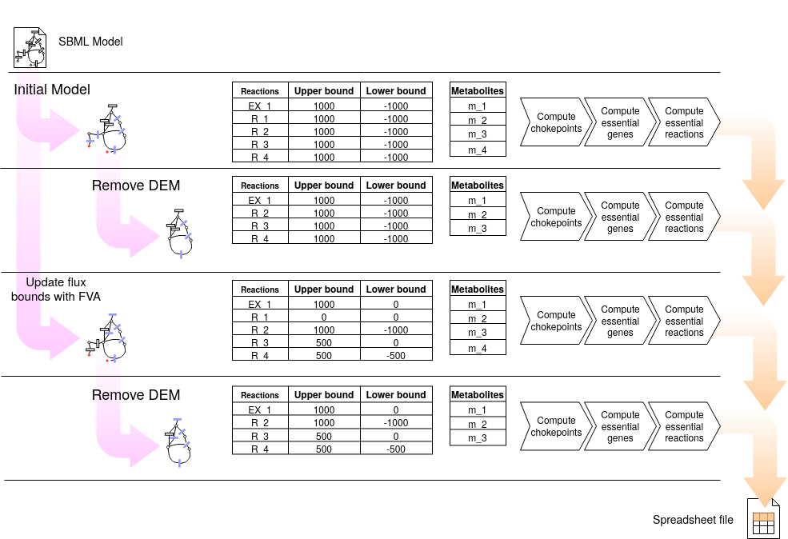

[](https://badge.fury.io/py/findCPcli) [](https://www.gnu.org/licenses/gpl-3.0) [](https://travis-ci.org/findCP/findCPcli) [](https://sonarcloud.io/dashboard?id=findCP_findCPcli) [](https://github.com/RichardLitt/standard-readme) [](https://github.com/psf/black)

## findCPcli - find ChokePoint reactions in genome-scale metabolic models

```findCPcli``` is a command line python-tool for the computation of chokepoint reactions in genome-scale metabolic models. 
The main purpose of the tool is to compute chokepoints by taking into account both the topology and the dynamic information of the network. In addition to the computation of chokepoints, findCPcli can compute and remove dead-end metabolites, find essential reactions and update the flux bounds of the reactions according to the results of Flux Variability Analysis. 

findCPcli takes as input an SBML files of genome-scale models, and provides as output a spreadsheet file with the results of the chokepoint computation.

**Chokepoint reactions:** Chokepoint reactions are those reactions that are either the unique consumer or the only producer of a given metabolite. findCPcli makes use of the flux bounds of the model to determine consumer and producer reactions, and in turn, to compute chokepoint reactions.

**Dead-End Metabolites (DEM):** Dead-end metabolites are those metabolites that are not produced or consumed by any reaction.

**Essential Reactions:** A reaction is considered an essential reaction if its deletion, this is, restricting its flux to zero, causes the objective (e.g. cellular growth) to be zero.


_Figure:_ Chokepoint reactions and dead-end metabolites example:


The computation of chokepoints can also be exploited programmatically via the [Low Level API](#low-level-api) which is based on [COBRApy](https://github.com/opencobra/cobrapy).


## Table of Contents
- [License](#license)
- [Pseudocode](#pseudocode)
- [Install](#Install)
- [Documentation and Examples](#documentation-and-examples)
  - [Pseucodode](#pseudocode)
  - [Compute chokepoints](#compute-chokepoints)
  - [Compute growth dependent chokepoints](#compute-growth-dependent-chokepoints)
  - [Remove dead-end metabolites](#remove-dead-end-metabolites)
  - [Refine model with FVA](#refine-model-with-fva)
- [Tool parameters](#tool-parameters)
- [Low Level API](#low-level-api)
- [Maintainers](#maintainers)
- [Contributing](#contributing)


## License

findCPcli is released under [GPLv3 license](LICENSE).


For citation purposes please refer to:

Oarga et al. **Growth Dependent Computation of Chokepoints in Metabolic Networks.** International Conference on Computational Methods in Systems Biology. Springer, Cham, 2020. https://doi.org/10.1007/978-3-030-60327-4_6


## Install
```findCPcli``` can be installed via **pip**:
```shell
$ pip install findCPcli
```

## Documentation and Examples

### Pseudocode
The following section includes pseudocode of some of the main operations performed by ```findCPcli```.

- Find chokepoints on a model

```
    function find_chokepoints(model)
        chokepoint_list = empty list
        for reaction in model
            if reaction upper flux bound not equal 0 and lower flux bound not equal 0
                for reactant in reaction
                    if reaction is the only consumer of reactant
                        chokepoint_list = chokepoint_list + (reaction, reactant)
                for product in reaction
                    if reaction is the only producer of product
                        chokepoint_list = chokepoint_list + (reaction, product)
        return chokepoint_list
```

- Find dead-end metabolites on a model
```
    function find_dead_end_metabolites(model)
      dem_list = empty list
      for metabolite in model
          if length(metabolite.consumers) == 0 or length(metabolite.producers) == 0
              dem_list = dem_list + metabolite 
      return dem_list
```

- Remove dead-end metabolites on a model
```
    function remove_dead_end_metabolites(model) 
        while number of metabolites in model does not change:
            find_dead_end_metabolites(model)
            delete all dead-end metabolites in model
            for reaction that produced or consumed dead-end metabolites:
                if reaction produces or consumes 0 metabolites [and is not exchange nor demand]:
                    delete reaction on model
            find_dead_end_metabolites(model)
        return model
```

- Update model flux bounds with Flux Variability Analysis
```
    function update_flux_bounds_with_fva(model, fraction_of_optmimum_growth) 
        max_fva, min_fva = flux_variability_analysis(model, fraction_of_optmimum_growth)
        for reaction in model
            reaction.upper_flux_bound = max_fva[reaction]
            reaction.lower_flux_bound = min_fva[reaction]
        return model
```

- Find essential reactions
```
    function find_essential_reactions(model)
      essential_reactions = empty list
      for reaction in model
          only knock out reaction
          if flux_balance_analysis on model is 0
              essential_reactions = essential_reactions + reaction
      return essential_reactions
```

### Compute chokepoints

findCPcli allows, from a model in SBML format, the generation of a spreadsheet with the computation of chokepoints and other points of interest of the model (such as dead-end metabolites, essential reactions and essential genes).

```shell
$ findCPcli -i model.xml -o generate_output.xls 
```

The following figure shows the pipeline of the chokepoint computation process. This is, the 4 models generated and the calculations performed on each one.


The previous command produces a spreadsheet file containing the following sheets:
 - ```model_info```: general model information.
 - ```reactions```: list of reactions of the model
- ```metabolites```: list of metabolites of the model
- ```genes```: list of genes of the model
- ```reactions_FVA```: Upper and lower flux bound of each reaction obtained with Flux Variability Analysis.
- ```metabolites_FVA```: Upper and lower flux bound of each reaction obtained with Flux Variability Analysis grouped by metabolite.
- ``` reversible_reactions ```:  List of reversible reactions of the model before and after FVA refinement.
- ```chokepoints```: Chokepoint reactions and the metabolite/s they produce/consume. Chokepoints are computed in 4 different models:
  1. Input model
  2. Model without DEM.
  3. Model refined with FVA.
  4. Model refined with FVA and without DEM.
- ``` dead-end ```:  Dead-end metabolites before and after FVA refinement.
- ``` essential genes ```: List of essential genes of the model. Essential genes are computed in the 4 previously listed models.
- ``` essential reactions ```: List of essential reactions of the model. Essential reactions are computed in the 4 previously listed models.
- ``` comparison ```: Comparison of chokepoint, essential reactions and essential gene reactions in the 4 previously listed models.
- ``` summary ```:  Comparison the size of the previous sets and their intersections.

### Compute growth dependent chokepoints

findCPcli allows, from a model in SBML format, to calculate how refining the model with different values of the fraction of the optimum with FVA affects the number of chokepoints
(i.e. [Growth Dependent Chokepoints](https://doi.org/10.1007/978-3-030-60327-4_6)).
, reversible and non reversible reactions and dead reactions (i.e. reactions with upper and lower bound equal to 0).
The tool produces a spreadsheet file showing how the size of these set varies.

```shell
$ findCPcli -i model.xml -cp generate_output.xls 
```

The pipeline pseudocode of this operation is included below:
```
    model = read_model()
    reversible_reactions     = all reactions with upper flux bound > 0 and lower flux bound < 0
    dead_reactions           = all reactions with both upper and lower flux bound equal to 0
    non_reversible_reactions = model.reactions - reversible_reactions - dead_reactions
    chokepoint_reactions     = find_chokepoints(model)
    
    for fraction in [0,0 ... 1,0]
        model = read_model()
        model = update_flux_bounds_with_fva(model, fraction)
        reversible_reactions     = all reactions with upper flux bound > 0 and lower flux bound < 0
        dead_reactions           = all reactions with both upper and lower flux bound equal to 0
        non_reversible_reactions = model.reactions - reversible_reactions - dead_reactions
        chokepoint_reactions     = find_chokepoints(model)
```

### Remove Dead-End Metabolites

The following command exports a new generated model without Dead-End Metabolites from an input SBML model.

```shell
$ findCPcli -i model.xml -swD new_model.xml
```

### Refine model with FVA
findCPcli can generate a new model in which the flux bounds of the reactions have been updated with the values obtained in the computation of FVA . 
In this way the model can receive a different topology and the number of chokepoints, essential reactions or dead reactions, among others, can vary.


```shell
$ findCPcli -i model.xml -sF new_model.xml
```

Alternatively a new model can be generated refined with FVA and with DEMs removed after.

```shell
$ findCPcli -i model.xml -swDF new_model.xml
```

## Tool parameters
```shell
$ findCPcli [-h] [-v] [-l] -i <input file> [-o <output file>]
                 [-cp <output file>] [-swD <output file>] [-sF <output file>]
                 [-swDF <output file>]

                       
optional arguments:
  -h, --help           show this help message and exit
  -v, --verbose        Print feedback while running.
  -l, --license        View license info.
  -i <input file>      Input metabolic model. Allowed file formats: .xml .json
                       .yml
  -o <output file>     Output spreadsheet file with results. Allowed file
                       formats: .xls .xlsx .ods
  -cp <output file>    Output spreadsheet file with growth dependent
                       chokepoints. Allowed file formats: .xls .xlsx .ods
  -swD <output file>   Save output model without Dead End Metabolites. Allowed
                       file formats: .xml .json .yml
  -sF <output file>    Save output model with reactions bounds updated with
                       Flux Variability Analysis. Allowed file formats: .xml
                       .json .yml
  -swDF <output file>  Save output model with reactions bounds updated with
                       Flux Variability Analysis and without Dead End
                       Metabolites. Allowed file formats: .xml .json .yml
  -objective <reaction id>
                        Reaction id to be used as objective function with Flux
                        Balance Analysis
```

## Low Level API

The computation of chokepoints can also be exploited via [findCPcore](https://github.com/findCP/findCPcore) which is used by findCPcli. 
[findCPcore](https://github.com/findCP/findCPcore) documentation can be found at [readthedocs](https://findcpcore.readthedocs.io/en/latest/).

Example of network refinement and chokepoint computation:
```python
from findCPcore import CobraMetabolicModel

model = CobraMetabolicModel("aureus.xml")

# update flux bounds with FVA
model.fva(update_flux=True)

# compute chokepoints
model.find_chokepoints()

# get chokepoints
model.chokepoints()
```

## Maintainers

[@alexOarga](https://github.com/alexOarga)

## Contributing

Feel free to dive in! [Open an issue](https://github.com/findCP/findCPcli/issues/new) or submit PRs.

Standard Readme follows the [Contributor Covenant](http://contributor-covenant.org/version/1/3/0/) Code of Conduct.


