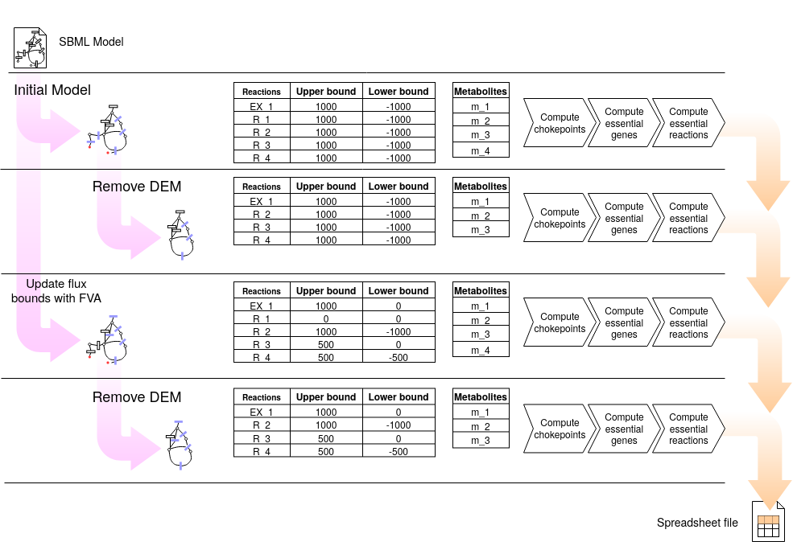

4.1. Compute chokepoints
===================

findCPcli allows, from a model in SBML format, the generation of a spreadsheet with the computation of chokepoints and other points of interest of the model (such as dead-end metabolites, essential reactions and essential genes).

::

    $ findCPcli -i model.xml -o generate_output.xls 

The following figure shows the pipeline of the chokepoint computation process. This is, the 4 models generated and the calculations performed on each one.

Spreadsheet data
******************

The previous command produces a spreadsheet file containing the following sheets:

- ``model_info``: general model information.
- ``reactions``: list of reactions of the model
- ``metabolites``: list of metabolites of the model
- ``genes``: list of genes of the model
- ``reactions_FVA``: Upper and lower flux bound of each reaction obtained with Flux Variability Analysis.
- ``metabolites_FVA``: Upper and lower flux bound of each reaction obtained with Flux Variability Analysis grouped by metabolite.
- ``reversible_reactions``:  List of reversible reactions of the model before and after FVA refinement.
- ``chokepoints``: Chokepoint reactions and the metabolite/s they produce/consume. Chokepoints are computed in 4 different models:   

  1. Input model.    
  2. Model without DEM.    
  3. Model refined with FVA.     
  4. Model refined with FVA and without DEM.    
- ``dead-end``:  Dead-end metabolites before and after FVA refinement.
- ``essential genes``: List of essential genes of the model. Essential genes are computed in the 4 previously listed models.
- ``essential reactions``: List of essential reactions of the model. Essential reactions are computed in the 4 previously listed models.
- ``comparison``: Comparison of chokepoint, essential reactions and essential gene reactions in the 4 previously listed models.
- ``summary``:  Comparison the size of the previous sets and their intersections.

