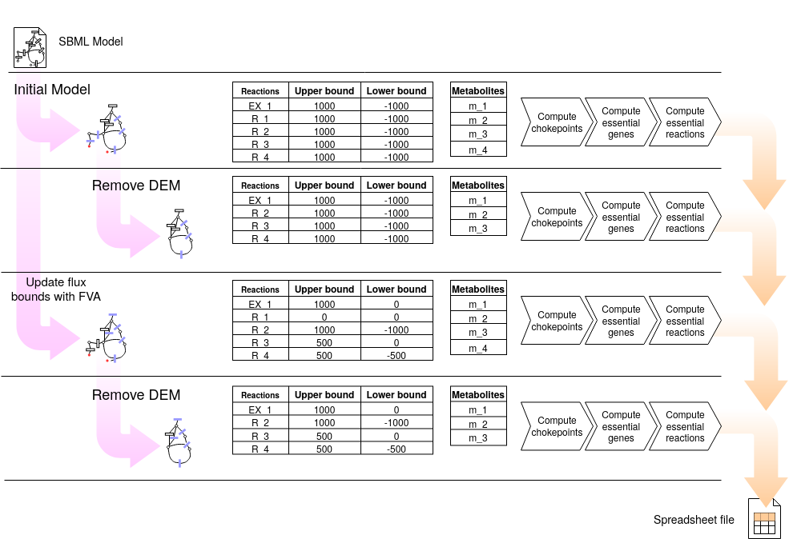

4. Compute chokepoints
===================

Given a genome-scale model in SBML format, findCPcli computes chokepoints, dead-end metabolites, essential reactions, and essential genes, and saves the results in a spreadsheet. findCPcli can be run as follows, where ``model.xml`` is the file with the SBML model and ``results.xls`` is the file where the results will be saved.

::

    $ findCPcli -i model.xml -o results.xls 

The following figure shows the pipeline of the chokepoint computation process. For a given SBML file, computations are performed on 4 models: i) model in the SBML file; ii) model without DEM; iii) model refined with FVA, i.e. with flux bounds updated according to FVA; and iv) model refined with FVA and without DEM.

4.1. Spreadsheet data
**********************

The previous command produces a spreadsheet file containing the following sheets:

- ``model_info``: General model information.
- ``reactions``: List of reactions of the model
- ``metabolites``: List of metabolites of the model
- ``genes``: List of genes of the model
- ``reactions_FVA``: Upper and lower flux bound of each reaction obtained with Flux Variability Analysis.
- ``metabolites_FVA``: Upper and lower flux bound of each reaction obtained with Flux Variability Analysis grouped by metabolite.
- ``reversible_reactions``:  List of reversible reactions of the model before and after FVA refinement.
- ``chokepoints``: Chokepoint reactions and the metabolite/s they produce/consume. Chokepoints are computed in 4 different models:   

  1. Input model in the SBML file.    
  2. Model without DEM.    
  3. Model refined with FVA.     
  4. Model refined with FVA and without DEM.    
- ``dead-end``:  Dead-end metabolites before and after FVA refinement.
- ``essential genes``: List of essential genes of the model. Essential genes are computed in the 4 previously listed models.
- ``essential reactions``: List of essential reactions of the model. Essential reactions are computed in the 4 previously listed models.
- ``comparison``: Comparison of chokepoint, essential reactions and essential gene reactions in the 4 previously listed models.
- ``summary``:  Comparison the size of the previous sets and their intersections.

