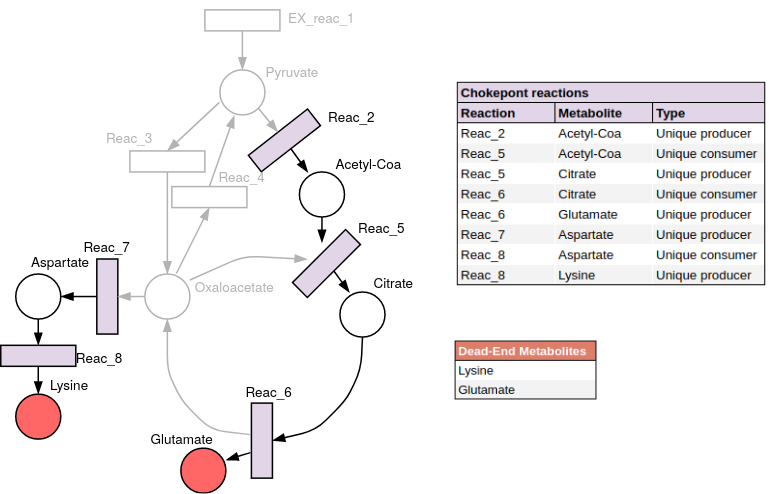

1. Introduction
===============

``findCPcli`` is a command line python-tool for the computation of chokepoint reactions in genome-scale metabolic models. 
The main purpose of the tool is to compute chokepoints by taking into account both the topology and the dynamic information of the network. In addition to the computation of chokepoints, findCPcli can compute and remove dead-end metabolites, find essential reactions and update the flux bounds of the reactions according to the results of Flux Variability Analysis. 

findCPcli takes as input an SBML files of genome-scale models, and provides as output a spreadsheet file with the results of the chokepoint computation.

1.1 Chokepoint reactions 
~~~~~~~~~~~~~~~~~~~~~~~~~~~
Chokepoint reactions are those reactions that are either the unique consumer or the only producer of a given metabolite. findCPcli makes use of the flux bounds of the model to determine consumer and producer reactions, and in turn, to compute chokepoint reactions.

1.2. Dead-End Metabolites (DEM) 
~~~~~~~~~~~~~~~~~~~~~~~~~~~~~~~~~
Dead-End Metabolites (DEM) are those metabolites that are not produced or consumed by any reaction.

1.3. Essential reactions
~~~~~~~~~~~~~~~~~~~~~~~~~~~~~~~~~
A reaction is considered an essential reaction if its deletion, this is, restricting its flux to zero, causes the objective (e.g. cellular growth) to be zero.

1.4. Example 
~~~~~~~~~~~~~~
Chokepoint reactions and dead-end metabolites example:

The computation of chokepoints can also be exploited programmatically via the `Low Level API <LowLevelAPI.html>`_ which is based on COBRApy_.

.. _COBRApy: https://github.com/opencobra/cobrapy

For citation purposes please refer to:

.. note:: Oarga et al. **Growth Dependent Computation of Chokepoints in Metabolic Networks.** International Conference on Computational Methods in Systems Biology. Springer, Cham, 2020. https://doi.org/10.1007/978-3-030-60327-4_6 .
